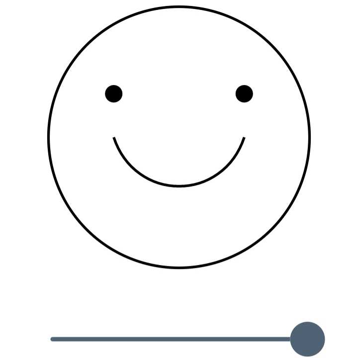
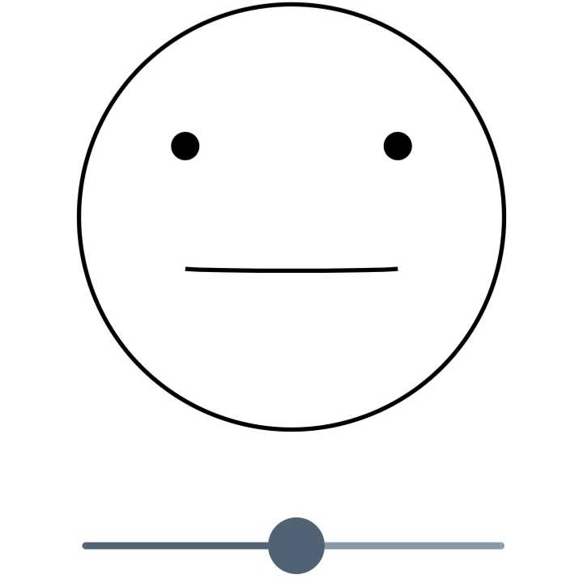
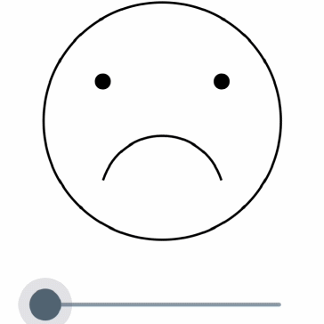

 

# Smile Slider

## 개요

* Slider로 사람의 입을 조절하기

## 코드 설명
~~~dart
end =  6.0  /  8.0  -  2.0  /  8.0  * rate; // 양 끝
mid =  4.0  /  8.0  +  2.0  /  8.0  * rate; // 가운데쪽 2개 점
var leftEnd =  Offset(size.width /  4, size.height * end); // 맨 왼쪽 점
var leftMid =  Offset(2  * size.width /  6, size.height * mid);// 가운데 중 왼쪽 점
var rightMid =  Offset(4  * size.width /  6, size.height * mid);// 가운데 중 오른쪽 점
var rightEnd =  Offset(3  * size.width /  4, size.height * end);// 맨 오른쪽 점

mouse.moveTo(leftEnd.dx, leftEnd.dy); // 맨 왼쪽 점부터 시작
mouse.cubicTo(leftMid.dx, leftMid.dy, rightMid.dx, rightMid.dy, rightEnd.dx,rightEnd.dy);
canvas.drawPath(mouse, face);
~~~

* rate는 0~1.0 입니다. (0 : 슬플 때, 1: 기쁠 때)
* 4개의 점을 이용하여 곡선을 그리기 위해 점의 위치를 정합니다.
* cubicTo 함수를 이용하여 4개의 점으로 곡선을 그립니다.

## Flutter 적용 코드

~~~dart
Column(
    children: <Widget>[
        CustomPainter(
            painter : Smile(rate : sliderValue),
        ),
        Slider(
            value: sliderValue,
            onChanged: ((v) => setState(() => sliderValue = v)),
        ),
    ],
)
~~~

## 예시

#### 웃을 때

 

#### 평범할 때
 

#### 슬플 때
 

#### 애니매이션

